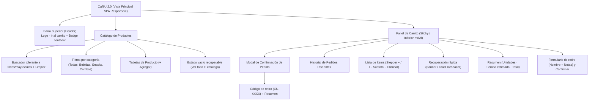

# Sitemap (Arquitectura de Información) — CaféU 2.0

```mermaid
flowchart TD
    HOME["CaféU 2.0 (Vista Principal SPA Responsive)"]
    HEADER["Barra Superior (Header)<br/>Logo · Ir al carrito + Badge contador"]
    CAT["Catálogo de Productos"]
    CART["Panel de Carrito (Sticky / Inferior móvil)"]
    MODAL["Modal de Confirmación de Pedido"]
    HIST["Historial de Pedidos Recientes"]

    HOME --> HEADER
    HOME --> CAT
    HOME --> CART
    CART --> MODAL
    CART --> HIST

    CAT --> BUSQ["Buscador tolerante a tildes/mayúsculas + Limpiar"]
    CAT --> CHIPS["Filtros por categoría (Todas, Bebidas, Snacks, Combos)"]
    CAT --> GRID["Tarjetas de Producto (+ Agregar)"]
    CAT --> EMPTY["Estado vacío recuperable (Ver todo el catálogo)"]

    CART --> ITEMS["Lista de ítems (Stepper − / + · Subtotal · Eliminar)"]
    CART --> UNDO["Recuperación rápida (Banner / Toast Deshacer)"]
    CART --> TOTAL["Resumen (Unidades · Tiempo estimado · Total)"]
    CART --> FORM["Formulario de retiro (Nombre + Notas) y Confirmar"]

    MODAL --> CODE["Código de retiro (CU-XXXX) + Resumen"]
```
